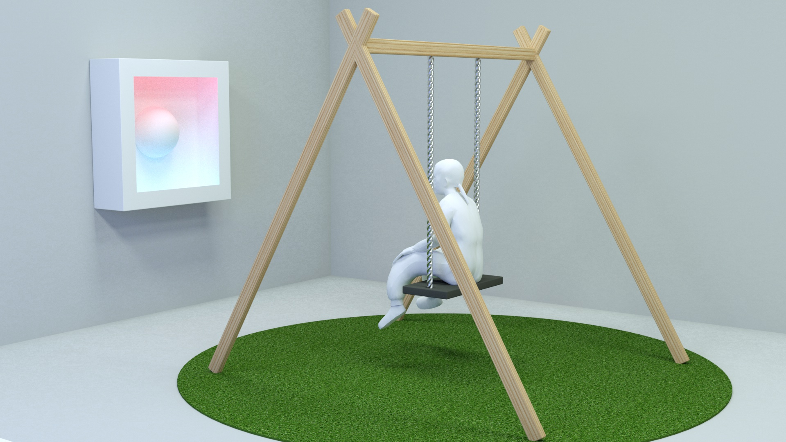

# COLUMPIO



## Introducción

Columpio con giroscopios acelerómetro que modifica un cuadro.
El cuadro puede ser sólo lumínico, que se ilumine al recibir movimiento.
El columpio es inclusivo, adjunto referencia.

**[Documentación API](#nombre)**

## Electrónica

### Leds

Estoy utilizando una tira de les WS2812B con 60 leds por metro.
Esta tiene la particularidad de permitir el control individual de los leds.
Elegí trabajar con la librería FastLED porque funciona con varios modelos de tiras de led, está bien documentada y cuenta con características como convertir RGB a HSV y transiciones con operaciones matemáticas.

#### Circuito básico, "Hello leds".


```c
/**
   Led Stripe testing

   I'm using the WS2812B with 60 leds per meter
   This led stripe has 3 wires
   White (GND): to Ground POWER and to Arduino GND
   Red (VCC): to 5v POWER and to Arduino 5v if this is not connected via USB
   Green (DATA): to ARDUINO LED_PIN (digital or ~ is the same)
   Note: If you are not using an external power source change the NUM_LEDS to less than 10.
*/
#include <FastLED.h>

#define LED_PIN     7
#define NUM_LEDS    60
CRGB leds[NUM_LEDS];

void setup() {
  FastLED.addLeds<WS2812, LED_PIN, GRB>(leds, NUM_LEDS);
}

void loop() {
  for (int i = 0; i <= NUM_LEDS; i++) {
    leds[i] = CRGB ( 0, 0, 255);
    FastLED.show();
    delay(40);
  }
  for (int i = NUM_LEDS; i >= 0; i--) {
    leds[i] = CRGB ( 255, 0, 0);
    FastLED.show();
    delay(40);
  }
  for (int i = 0; i <= NUM_LEDS; i++) {
    leds[i] = CRGB ( 0, 255, 0);
    FastLED.show();
    delay(40);
  }
  for (int i = NUM_LEDS; i >= 0; i--) {
    leds[i] = CRGB ( 255, 0, 255);
    FastLED.show();
    delay(40);
  }
}
```

#### Links útiles

- [FastLed Library](https://github.com/FastLED/FastLED): Librería para controlar los leds
- [FastLed Documentaion](https://github.com/FastLED/FastLED/wiki/Overview): Documentación de la librería
- [FastLed Community](https://github.com/FastLED/FastLED): Comunidad de la librería
- [Tutorial para controlar leds individualmente](https://howtomechatronics.com/tutorials/arduino/how-to-control-ws2812b-individually-addressable-leds-using-arduino/)
- [Alimentar tira de led con fuente de PC](https://www.youtube.com/watch?v=srJgt85cUMY): Tutorial

### Giroscopio

Aceleración y acelerómetros
La aceleración es la variación de la velocidad por unidad de tiempo es decir razón de cambio en la velocidad respecto al tiempo:

**a=dV/dt**

Así mismo la segunda ley de Newton indica que en un cuerpo con masa constante, la aceleración del cuerpo es proporcional a la fuerza que actúa sobre él mismo:

**a=F/m**

Este segundo concepto es utilizado por los acelerómetros para medir la aceleración. Los acelerómetros internamente tienen un MEMS(MicroElectroMechanical Systems) que de forma similar a un sistema masa resorte permite medir la aceleración.

Con un acelerómetro podemos medir esta aceleración, teniendo en cuenta que a pesar que no exista movimiento, siempre el acelerómetro estará sensando la aceleración de la gravedad.

Con el acelerómetro podemos hacer mediciones indirectas como por ejemplo si integramos la aceleración en el tiempo tenemos la velocidad y si la integramos nuevamente tenemos el desplazamiento, necesitando en ambos casos la velocidad y la posición inicial respectivamente.

### Comunicación WiFi

## Link a su apartado en la documentación

## Diagramas

## Circuito

## Código

Qué son los Websockets? (adaptar resumen desde acá https://youtu.be/lcJzVP20McM?t=3m4s)

- [Nombre](#examples/nombre) - Descripción
- [Nombre](#examples/nombre) - Descripción
- [Nombre](#examples/nombre) - Descripción

## Memoria

## Bibliografía

- Socket.IO Real-time Web Application Development, Rohit Rai. Packtpub, 2013.

## Enlaces útiles

- [Librería para los leds](https://github.com/FastLED/FastLED)
- [Tutorial para los leds](https://howtomechatronics.com/tutorials/arduino/how-to-control-ws2812b-individually-addressable-leds-using-arduino/)
- [Alimentar tira de led con fuente de PC](https://www.youtube.com/watch?v=srJgt85cUMY)

- [Tutorial MPU6050, Acelerómetro y Giroscopio](https://naylampmechatronics.com/blog/45_Tutorial-MPU6050-Aceler%C3%B3metro-y-Giroscopio.html)

* [Arduino Wireless Communication – NRF24L01 Tutorial](https://howtomechatronics.com/tutorials/arduino/arduino-wireless-communication-nrf24l01-tutorial/)
* [Tutorial básico NRF24L01 con Arduino](https://naylampmechatronics.com/blog/16_Tutorial-b%C3%A1sico-NRF24L01-con-Arduino.html)

* [Usando ESP8266 con el IDE de Arduino](https://naylampmechatronics.com/blog/56_usando-esp8266-con-el-ide-de-arduino.html)
